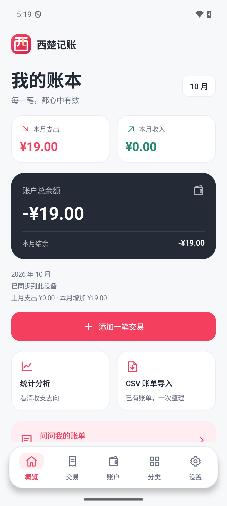
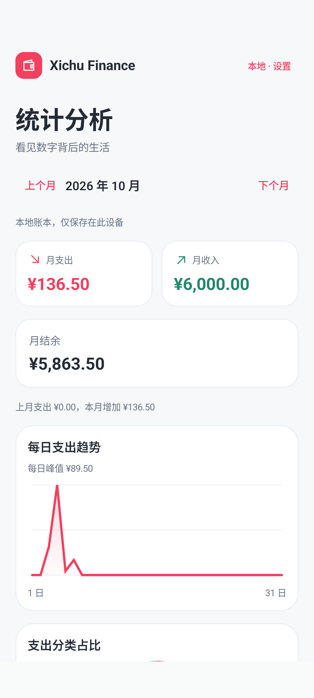
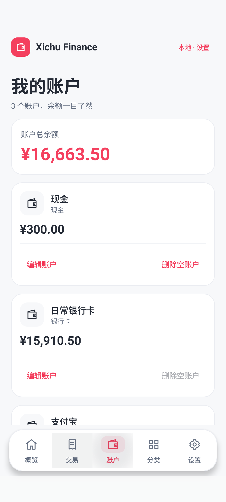

# 西楚记账

西楚记账是一款开源个人记账应用，支持独立的本地和云端账本。当前 Android 签名版为 **v1.0.4**，修复了新账本没有账户时无法保存收支的问题：可在记账页直接添加并选中账户，保留已填内容。支持分类改名和删除、登录与同步优化，设置统一从底部进入。保留中文名称和原创图标。见 [版本说明和验收记录](docs/RELEASE_NOTES_v1.0.4.md)、[项目状态](docs/PHASE_STATUS.md)。Repository remains `xichugeek/XichuFinance`.


All examples/screenshots are fictional. The app never asks for full bank card numbers, CVV, payment passwords or identity numbers. This is a personal bookkeeping project, not a banking system.



## Features

- Kotlin, Compose, Material 3, Navigation, ViewModel and Room.
- Accounts, category creation/rename/deletion, transaction CRUD and exact CNY money arithmetic. Referenced categories cannot be deleted until their transactions/rules are reassigned or removed.
- Monthly totals, daily expense trends, category charts and largest expenses.
- Standard CSV preview, confirmation and duplicate skipping.
- Email/password cloud authentication, Keystore encrypted session and isolated per-user cache.
- Offline reading; separate local ledger with fictional first-run examples, never uploaded automatically.
- Personal classification rules and shared keywords.
- Seven Chinese Ask Finance intents with database-calculated amounts and templates.
- **AI Enhancement Disabled**: NoAIProvider ships in v1; no paid AI API or key required.





## Install and use

Download the official signed APK and SHA256 sidecar from [西楚记账 v1.0.4 — GitHub Release](https://github.com/xichugeek/XichuFinance/releases/tag/v1.0.4). Choose `XichuFinance-v1.0.4.apk` in Assets to install; the Source code archives contain source. This is the accepted APK from `dist/XichuFinance-v1.0.4.apk`, unchanged from verification.

Build outputs remain ignored by Git; cloning this repository gives source, without the owner's private signing key or a downloaded APK. Public users can also [build an independently signed APK](docs/ANDROID_RELEASE.md). No Play Store submission is claimed.

Copy the APK to an Android 8.0+ phone, allow installation from the file manager when prompted, and open **西楚记账**. Install over the owner's previous signed version to preserve its ledger; do not uninstall for this update. Choose “打开本地账本” for local use, or register/login for a separate cloud ledger. **Installing/using the Release needs no Docker on your phone or PC.** Docker is needed to run your own Backend.

The accepted Release connects to `https://finance-api.demo.xichugeek.com/`. Cloud accounts start empty: create an account, then add transactions. Keep your password safely; v1 has no password reset. Never uninstall an existing app with needed data to resolve a signing conflict. See [beginner guide / 小白教程](docs/BEGINNER_GUIDE.md).

## Architecture

Android UI → ViewModel → Repository → Room / Retrofit → FastAPI → PostgreSQL.

Backend: SQLAlchemy 2, Pydantic, Alembic, Argon2 password hashes and 12-hour JWTs. Android uses integer cents/BigInteger aggregates; Backend uses NUMERIC/Decimal. Production uses two isolated Finance containers without host ports and the existing Caddy HTTPS gateway. See [architecture](docs/ARCHITECTURE.md) and [API](docs/API.md).

## Build Android

Install Android Studio, JDK 21 and Android SDK 36.1. From `android/` on Windows:

```powershell
.\gradlew.bat :app:assembleDebug
```

Version combination: AGP 9.1.1, Gradle 9.3.1, Kotlin 2.2.10. Debug uses the local emulator API `http://10.0.2.2:8000/`. For the owner's existing private signing configuration, run from the repository root:

```powershell
python scripts/build_release.py --instrumentation --bundle
```

This requires private credentials outside the checkout. Other developers create their own key using the [Release guide](docs/ANDROID_RELEASE.md). A successful build alone does not establish runtime acceptance.

## Run a local Backend

With Python 3.12 and Docker Engine running, from the repository root:

```powershell
python scripts/setup_local_env.py
docker compose --project-name xichufinance up -d --build --wait
python scripts/validate_backend.py
```

API docs: `http://127.0.0.1:8000/docs`. Setup creates ignored random secrets without displaying or overwriting them. PostgreSQL has no host port. See [local Backend](docs/BACKEND_PHASE_3.md) for network mirror options. Windows Docker Desktop requires WSL 2 and hardware virtualization.

## Import, deploy and test

- [Standard CSV format](docs/CSV_FORMAT.md): raw bank/WeChat/Alipay exports are not verified; convert first.
- [Classification rules](docs/CLASSIFICATION_PHASE_7.md) and [supported Ask questions](docs/ASK_PHASE_8.md).
- [Server deployment, backup/restore and rollback](docs/SERVER_DEPLOYMENT.md): audit the server and obtain its owner's approval before DNS, production writes or infrastructure changes.
- [Signed build/install](docs/ANDROID_RELEASE.md), [current Release acceptance](docs/RELEASE_NOTES_v1.0.4.md) and [final checklist](docs/PROJECT_READY.md).

Backend tests: from `backend/`, install `requirements-dev.txt` in a venv and run `python -m pytest -q`. Android local tests: from `android/`, run `.\gradlew.bat :app:testDebugUnitTest :app:connectedDebugAndroidTest` with the local API/emulator running. The default HTTP validator writes fictional data only to loopback. Its explicit production mode and Release workflow test require the service owner's authorization for fictional writes.

Recorded results: 16 Backend tests, 11 original local JVM tests and 9 original local device tests. v1.0.1 checked real layouts at 411 dp / normal font and 320 dp / 1.3 font scale; v1.0.2 verified branding/update behavior. v1.0.3 passed a clean signed build, 18 Release JVM tests, real device cache/error regression and a full signed production UI workflow over direct HTTPS. v1.0.4 additionally passed the empty-account creation/cancel/draft-retention path and both expense/income saves using the actual chosen account; its clean build has 18 Release JVM tests and the full signed workflow passed. Release Lint has 0 errors / 14 warnings. Run `python scripts/secret_review.py` and manually review changed files before commits.

## v1 limits

CNY only. Cloud writes/import/Ask need connectivity; cached records remain readable offline, without a write queue. Refresh uses a complete server snapshot. Local/cloud ledgers remain separate. Intermittent network problems can require manual refresh.

No password reset, email verification, MFA, dedicated registration rate limiting, JWT refresh/revocation or complete user deletion/export/retention UI. Room records are unencrypted. Questions use limited Chinese intents; external AI is not configured. Finance backups/restore were verified, but scheduling and off-server backup service are not configured. Physical devices, OEM transfer and Play submission are not verified. Read [security](docs/SECURITY.md) and [privacy](docs/PRIVACY.md) before using sensitive data.

## License

Project source is licensed under [MIT](LICENSE). Dependencies retain their own licenses. Build/signing instructions do not grant access to the owner's signing key or server credentials.
