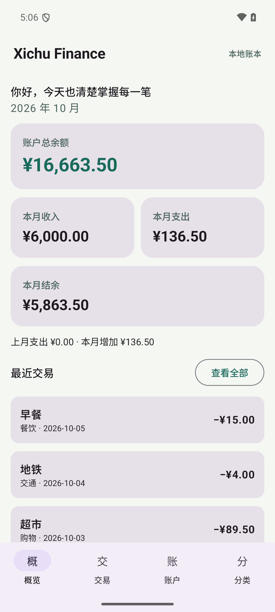

# Xichu Finance

Xichu Finance is an open source personal finance tracker in development. This repository is being built in stages. The current stage is the Android local MVP; the cloud Backend, PostgreSQL, CSV import, analytics, production API, and signed release APK are not yet available.

The app stores account names, categories, and transactions locally with Room. All bundled example transactions are fictional. It never asks for a real card number, CVV, bank password, or identity number. This is a personal bookkeeping project, not a banking system.



## Current Android stage

- Kotlin, Jetpack Compose, Material 3, Navigation Compose, ViewModel, and Room.
- Local dashboard, transaction create/read/update/delete, accounts, and categories.
- Integer minor units for money; no floating point database amounts.
- A fictional data set is inserted on first launch.

To build locally on Windows, install Android Studio and the Android SDK, then run from `android/`:

```powershell
.\gradlew.bat :app:assembleDebug
```

The project is configured for JDK 21, AGP 9.1.1, Gradle 9.3.1, and Android SDK 36.1. See [the environment audit](docs/PROJECT_002_PREFLIGHT.md) for what was present on the development machine. The Debug APK is an interim development artifact and is not the required signed release APK.

## Status

The local Android MVP passed [build, test, and emulator validation](docs/ANDROID_LOCAL_MVP.md). Later phases add the Backend, synchronization, CSV import, analytics, automatic classification, Ask Finance, Docker deployment, production HTTPS, and a signed release APK.
