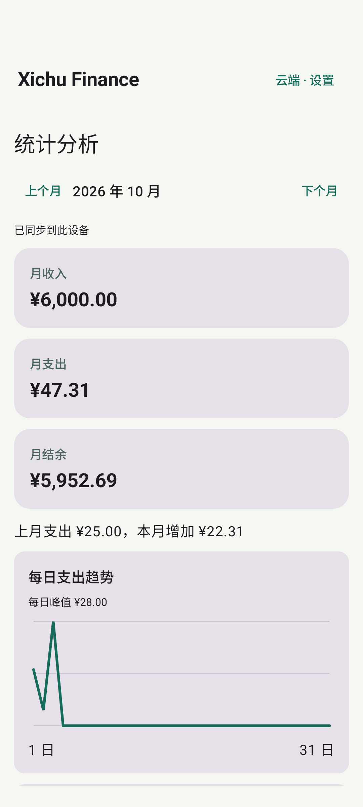
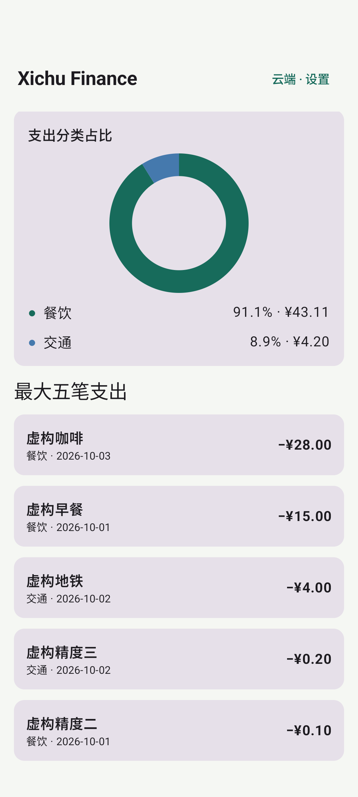

# PHASE 6 — Analytics

Verified on 2026-10-06 (Asia/Shanghai), using the local Docker API/PostgreSQL and Pixel 7 Android 15 emulator.

## Implemented

- Dashboard and Analytics show income, expense, balance, previous-month change, daily expense line chart and category donut chart.
- Analytics switches months and lists the largest five expenses and recent transactions, with links to details.
- Android stores individual amounts as integer cents and aggregates with `BigInteger`, including sums exceeding `Long` range. Floating point is used only for chart coordinates.
- Backend totals, category rankings and daily trends are computed by SQL on the authenticated user's records. Money is returned as decimal strings.
- `GET /analytics/largest` returns owned expenses in descending amount/date/ID order; its limit is 1–20.
- Empty months and February/leap years are handled. Cached Android data supports offline analysis; a stale cache can differ from newer server records until refresh.

## Actual evidence

| Check | Result |
| --- | --- |
| Backend `pytest -q` | 11 passed; precision, month boundaries, rankings and cross-user isolation included |
| Android JVM tests | 9 passed: money, CSV parsing and monthly analytics |
| Debug app and test APK build | Successful |
| Docker rebuild and health | API and PostgreSQL healthy |
| Real HTTP/PostgreSQL acceptance | `BACKEND_LOCAL = PASS`, including decimal analytics and CSV |
| `Phase6AnalyticsUiTest` on emulator | `OK (1 test)` |

The device test creates eight fictional transactions through the real API, refreshes Room, and compares Android income/expense/balance/previous-month totals with database responses. It verifies daily/category totals, navigates to Analytics, checks both charts and switches to the previous month and back. The current expense is exactly `47.31`, income `6000.00`, balance `5952.69`, and previous expense `25.00`.

The first UI attempt used a selector for an uncomposed lazy-list item; the test was corrected to scroll the list to the item. A screenshot scroll was also corrected to include the whole chart. Final acceptance passed. Screenshots were pulled and visually inspected:

`ANALYTICS_LOCAL = PASS`. Production, classification, Ask Finance and release gates are separate.
