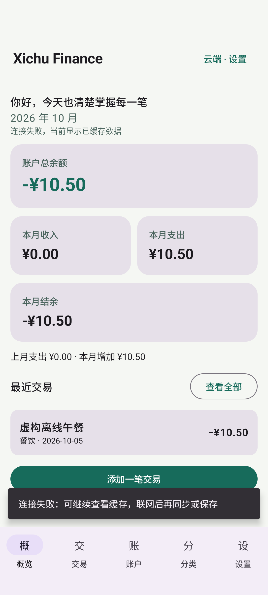

# PHASE 4 — Android and Backend integration

This is the historical record for this phase. Later production and Release results are in [current phase status](PHASE_STATUS.md).

Status: **ANDROID_BACKEND_LOCAL = PASS** (2026-10-05, Asia/Shanghai). This is local Debug integration acceptance; production API and Release APK acceptance remain open.

## Actual evidence

- Debug application and test APK build successfully; the three money unit tests pass.
- `:app:connectedDebugAndroidTest :app:testDebugUnitTest` completed with **3 device tests, 0 failures, 0 errors** on Pixel_7 / Android 15. The device tests exercise the real Docker/PostgreSQL API, the Compose workflow, and startup with a refused network connection.
- The Compose workflow registered a fictional user, logged in, created an account, added/edited/deleted a transaction, logged out, and logged in again.
- The isolated-cache test checked cross-user deletion denial, exact `12.34 → 10.50` conversion, account/category operations, token encryption at rest, and logout clearing.
- Offline startup displayed the cached fictional transaction and `¥10.50` expense after the client's network connection failed. The screenshot below was inspected for visible data and layout.
- A direct ADB install returned `Success` for both APKs; a direct offline UI test run returned `OK (1 test)`. These are Debug artifacts, not the final signed Release APK.



## Implemented behavior

- Splash, email/password login, registration, current-user display, settings, refresh, and logout.
- Retrofit/OkHttp and kotlinx.serialization call the Backend. Tokens and passwords are not logged; passwords are never persisted.
- Android Keystore AES-256-GCM encrypts the entire session before DataStore saves it. Each write uses a fresh IV; the session is bound to the configured server. Backup is disabled.
- Cloud accounts, categories, and transactions are cached in a separate Room database for each server/user pair. Local bookkeeping keeps its existing database and fictional first-launch examples. Cloud users do not receive those examples.
- Server responses are checked for ownership before replacing the cache. A refresh fetches and validates all responses before replacing cached tables in one Room transaction.
- Cloud writes are sent to the server first; accepted responses update the cache. Account creation/edit/delete and transaction creation/edit/delete use the API. Category creation is also connected.
- A failed refresh leaves the previous cache available. Expired login tokens require a fresh login for cloud changes, while cached records remain viewable.

## Development API

The Debug base URL is centrally configured in `android/app/build.gradle.kts` as `http://10.0.2.2:8000/`, the Android emulator address for the development computer. Start Docker Compose before logging in. Only Debug builds permit local cleartext addresses. Release is configured with the intended HTTPS domain `https://finance-api.demo.xichugeek.com/`; that domain is **NOT VERIFIED** and production integration is a later phase.

```powershell
cd android
.\gradlew.bat :app:testDebugUnitTest :app:assembleDebug
.\gradlew.bat :app:connectedDebugAndroidTest
```

The device tests create fictional users at `example.com`. They test real registration/login, account/category/transaction operations, decimal conversion, cross-user denial, refused-network cache preservation, encrypted token persistence, logout clearing, and the Compose workflow. Their remaining users/categories and fictional transactions are development data only. Gradle's connected test harness removes its installed app afterward; use `adb install -r app/build/outputs/apk/debug/app-debug.apk` to keep an interactive Debug app installed.

The offline UI test injects a client targeting a closed local port while loading the saved session and Room cache. It does not stop the Docker service. This verifies the client's disconnected startup behavior; a physical device airplane-mode check is not claimed.

## Sync limits

Server data is the source for cloud records. Room provides the latest synchronized snapshot and offline reading. This version uses explicit full refreshes and server `updated_at` timestamps; it has no background worker, pagination, offline write queue, automatic merging, or incremental conflict resolution. Concurrent edits use the most recently accepted server write. Use refresh before editing on a second device. A network timeout during a write has an uncertain outcome: refresh before retrying, because the server may have accepted it.

Logout clears the encrypted session and hides the user cache; it preserves cached database files for a later authenticated login. Room itself is not encrypted. The device's app sandbox, disabled backup, and device lock protect the cached records. The local ledger is a separate mode and is never uploaded automatically.

## Dependency choices

Versions stay compatible with the existing Kotlin 2.2.10 build: [Retrofit 3.0.0 / OkHttp 4.12](https://github.com/square/retrofit/releases/tag/3.0.0), [kotlinx.serialization 1.9.0](https://github.com/Kotlin/kotlinx.serialization/releases/tag/v1.9.0), and [DataStore 1.1.7](https://developer.android.com/jetpack/androidx/releases/datastore#1.1.7). Session storage follows [Android Keystore guidance](https://developer.android.com/privacy-and-security/keystore); Debug cleartext exceptions use [network security configuration](https://developer.android.com/privacy-and-security/security-config).
