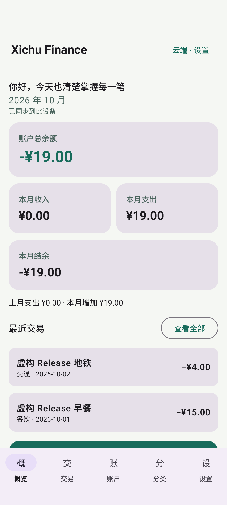
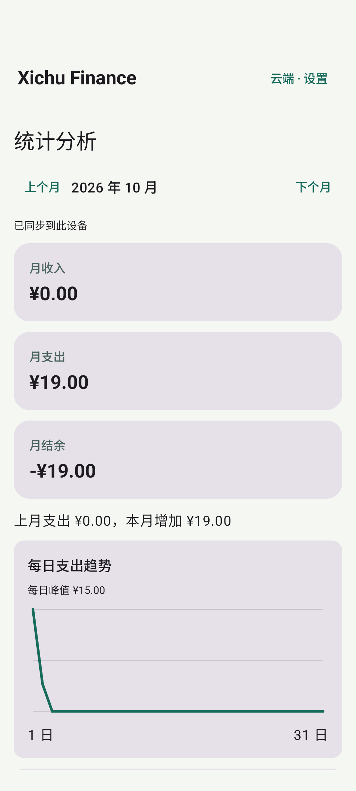
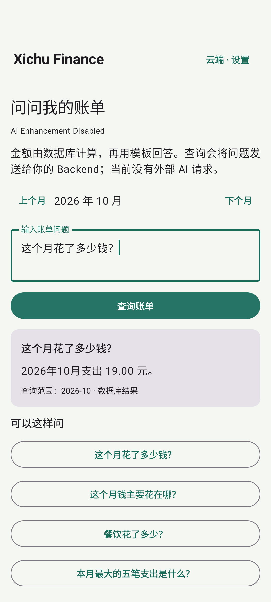

# Signed APK acceptance

**APK_RELEASE = PASS**, **SIGNED_APK = PASS**, **ADB_INSTALL = PASS**. Verified 2026-10-06 (Asia/Shanghai), against actual production HTTPS. This record concerns the signed Release.

| Gate | Actual evidence |
| --- | --- |
| Production HTTPS / API | [Production acceptance](SERVER_DEPLOYMENT.md): valid certificate, health 200 and full BACKEND_PRODUCTION PASS |
| Signing authorization | Owner authorized DNS/server/signing after the concrete plan was reported |
| Dedicated key | PKCS12, RSA 3072, SHA256withRSA; alias xichufinance-release; private local key and separate byte-verified backup with restricted ACLs |
| Clean build | `scripts/build_release.py --instrumentation --bundle`: BUILD SUCCESSFUL in 1m 43s, 105 executed tasks / 2 up-to-date; clean rebuilt application and tests; 11 Release JVM tests passed |
| Lint | 0 errors, 12 warnings: SDK/dependency updates and resource qualifiers |
| APK | `dist/XichuFinance-v1.0.0.apk`, 8,779,358 bytes |
| Signature | apksigner verification passed; one RSA-3072 signer; APK scheme v2 verified, compatible with minimum API 26 |
| Identity | com.xichugeek.finance; versionCode 1; versionName 1.0.0; label Xichu Finance; min SDK 26, target 35 |
| Actual configuration | Public HTTPS URL present; Debug HTTP emulator URL absent; backup and cleartext disabled, debugging absent/default false |
| Private file/value check | No key/env/credentials file inside APK; known local signing/database/JWT secret values absent from unpacked entries |
| Install / launch | Signed APK and same-key Release test APK installed on Pixel 7 / Android 15 emulator-5554; both installs returned Success |
| Production workflow | Final ReleaseWorkflowTest: `OK (1 test)`, 32.807 seconds; registered/login, created account, added/read/edited/deleted transaction through production |
| CSV | Preview caused no transaction writes; confirmed two fictional expenses 15.00 + 4.00; next preview reported 2 duplicates and disabled commit |
| Analytics / Ask | Exactly 19.00 expense; database_template answer, AI disabled; screenshots below |
| Session/data | Activity close/reopen retained two records; logout/login restored same user's records; authenticated API read returned two |
| Process/update | Final APK force-stop, same-signed install -r and am start -W returned COLD/status ok (959 ms); session, two records and 19.00 expense remained; subsequent cloud refresh also reached 已同步到此设备 |
| Optional AAB | Signed AAB generated, 8,391,564 bytes; not submitted to Play or installed as a bundle |

## Public hashes

```text
APK SHA256
1d535f986794148a1f5489e37f39d25d0b95a1ef1c87a5ade78f053c834e1813

AAB SHA256
19d7ae878548787221c3bf79e74de92e70b06443d4f9559097fbfd30b26e59e5

Signer certificate SHA256
8f69ab65fbbebf6fd1b715a842d2af82e69113c43fbd037161ba1e1280ccf160
```

Each artifact has a SHA256 sidecar. These hashes identify the final clean build with shared OkHttp connections and public-network timeouts. That exact APK was installed and tested, then rechecked after force-stop/reinstall.

## Runtime evidence and limits







All screenshots/acceptance records are fictional. The first test matched editor text before asynchronous save/navigation finished; it now waits for the destination screen and completed account creation. Public TLS handshakes then caused some failed trials, including one trial that completed UI operations but timed out on a new client's final server read. API instances now share the OkHttp pool with bounded 15-second connect / 30-second read / 60-second call timeouts. Authentication remains per request and certificate/hostname verification is unchanged. The final clean build passed the full workflow in 32.807 seconds, including the real server read. Its first trial had an initial handshake failure; acceptance does not imply reliable connectivity on every attempt.

During earlier process-restart trials, initial refresh encountered a connection failure and displayed the documented cache fallback. Data remained visible. The final APK force-stop, same-key reinstall and cold start retained the session and both cached records, then successfully resynchronized. Manual refresh remains available and network reliability still depends on connectivity. No TLS bypass or automatic replay of financial writes was added.

Physical phones, OEM transfer, Play submission, every supported Android version and external AI providers are **NOT VERIFIED**. Earlier Debug tests separately cover local categories, rules, offline cache and migrations. See [build/install guide](ANDROID_RELEASE.md) and [release notes](RELEASE_NOTES_v1.0.0.md).
