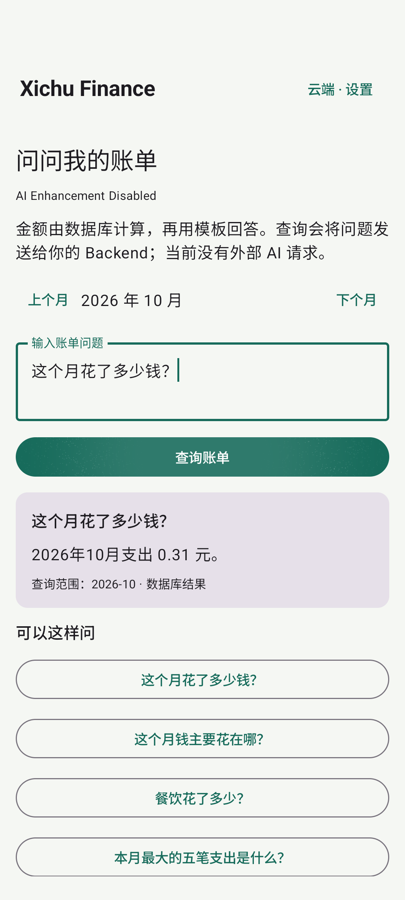

# PHASE 8 — Ask Finance

Verified locally on 2026-10-06 (Asia/Shanghai).

The Android **问问我的账单** screen sends a question and selected month to `POST /ai/ask`. The Backend maps supported Chinese phrases to a fixed intent, queries only the authenticated user's database rows, and formats the result with a template. No LLM calculates money or receives the question.

Supported intents: monthly expense, category ranking, expense for a named category, largest five expenses, income, balance, and category comparison with the previous month. The seven example questions in the app cover these intents. `上月` / `上个月` also selects the prior month for ordinary totals. The structured response includes intent, month, decimal strings/data, source, answer and disabled AI status.

This is a limited phrase recognizer, not unrestricted conversation or financial advice. Unknown intents return supported-question guidance instead of inventing an answer. Income and expense values come from SQL; balance and comparison subtract `Decimal` database totals. Ask requires an online cloud login. Local/offline users can use Analytics; query errors are shown normally. Questions and answers stay in app memory and are not stored as conversation history by the Backend.

## Actual evidence

- Backend: **15 pytest tests passed**, including all seven intents, `0.01 + 0.10 + 0.20 = 0.31`, large income, previous-month/category comparison, empty users, invalid dates/questions, authentication and unknown intents.
- Docker/PostgreSQL rebuilt and healthy; the real HTTP script passed Ask totals, rankings, largest expenses and cross-user isolation. `BACKEND_LOCAL = PASS` includes all local Backend features.
- Android: **10 JVM tests passed**, Debug app/test APK built and ADB installed.
- `Phase8AskUiTest` returned **OK (1 test)**. It created three fictional expenses through the real API and submitted a question through Compose. The displayed answer was exactly `2026年10月支出 0.31 元。`, from `database_template`, with AI disabled.
- The screenshot was pulled and visually inspected.

`ASK_FINANCE_LOCAL = PASS`. Production API and release acceptance remain open.
