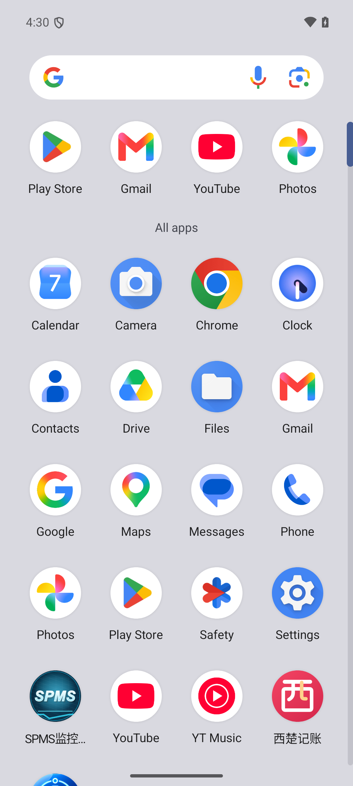
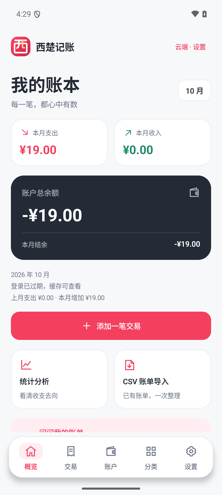
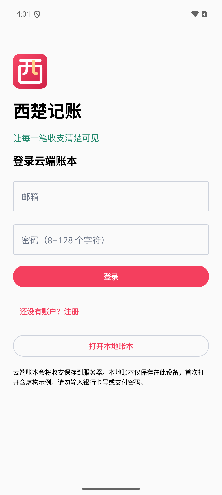

# 西楚记账 v1.0.2

Checked 2026-10-07 (Asia/Shanghai), in the original `XichuFinance` repository.

## Brand update

- Desktop/application name, loading screen, login screen and dashboard title now use **西楚记账**, with the title supplied by the shared `app_name` resource.
- Original red seal-like **西** vector monogram with a warm gold stroke. The adaptive icon keeps the mark within the safe zone and supports round/square launcher masks. Android 13+ has a separate monochrome layer for themed icons.
- The same mark appears inside the app. Standard CSV help now uses the Chinese display name.
- Package remains `com.xichugeek.finance`, version name **1.0.2**, code **3**, minimum API **26**, target API **35**. Existing session encryption identifiers and data storage paths are retained for update compatibility.


The editable [SVG](branding/xichu-jizhang.svg) is a preview of the Android vector mark. The actual launcher foreground/background and API 33 monochrome resources are under `android/app/src/main/res`. No external font or bitmap is needed by the Android icon.

## Verification performed for this version

| Check | Actual result |
| --- | --- |
| Clean signed APK/AAB build | PASS — 2m 3s, 107 tasks; 11 Release JVM tests |
| Release Lint | 0 errors / 13 warnings; current target/dependency notices and launcher resource notices are recorded in the local report |
| APK identity | PASS — `aapt2` reports label `西楚记账`, package `com.xichugeek.finance`, version `1.0.2` / code `3` |
| Signing | PASS — APK v2 verified; same RSA-3072 signing certificate as the previous Release; AAB signature verified (self-signed certificate, no timestamp) |
| Cover installation | PASS — `adb install -r` over the signed v1.0.1 returned Success, then a cold launch completed in 932ms |
| Existing ledger retention | PASS — fictional cached expense 19.00 CNY and balance -19.00 CNY remained visible after the update. The test session was already expired before installation; this check does not establish a fresh authenticated production session |
| Launcher | PASS — actual Android 15 launcher renders the red/gold mark and full `西楚记账` label; the packaged API 33 icon includes its monochrome layer |
| App titles | PASS — dashboard and login title use the Chinese name; UI hierarchy contains the cloud login and local-ledger entry buttons, with no English brand title |
| APK review | PASS — production HTTPS present; Debug emulator HTTP and checked private signing/database values absent; backup, cleartext and debugging disabled |

This is a branding update. The previous complete production workflow and small/large-font layout checks are recorded in [v1.0.1 acceptance](UI_REFRESH_v1.0.1.md); they were not repeated for this resource/title change. Physical/OEM launchers and every themed-icon setting are not yet verified. Existing [v1 limits](RELEASE_NOTES_v1.0.0.md#v1-limits) apply.

## Install

Use `dist/XichuFinance-v1.0.2.apk`. Install it over the owner's signed v1.0.0 or v1.0.1; **do not uninstall the old app for this update**. See [build and installation guide](ANDROID_RELEASE.md). Artifacts and SHA256 sidecars remain outside Git; earlier artifacts are preserved.

Public signing certificate SHA256:

```text
8f69ab65fbbebf6fd1b715a842d2af82e69113c43fbd037161ba1e1280ccf160
```

| Artifact | Bytes | SHA256 |
| --- | ---: | --- |
| `XichuFinance-v1.0.2.apk` | 8,798,390 | `fc1e3c6ce9581bd81ba5f9bd3e83ba0868d3114f9d429e75ee392d605368136c` |
| `XichuFinance-v1.0.2.aab` (optional) | 8,425,509 | `b9197e89aaa15c8b15730bae0ada1400fc9a4cd99270e692e26ee99f230b69e0` |

## Actual emulator screenshots






