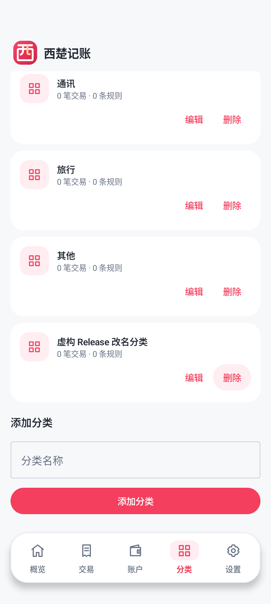

# 西楚记账 v1.0.3 — 分类管理与登录等待优化

Verified 2026-10-07 (Asia/Shanghai), in the existing `XichuFinance` repository. Package `com.xichugeek.finance`, version **1.0.3**, code **4**, same Release signer. Chinese name and original icon from [v1.0.2](RELEASE_NOTES_v1.0.2.md) are retained.

## Report and diagnosis

The owner reported a 1–2 minute login after reinstalling, using **China Telecom 5G mobile data**. The phone's actual DNS/TCP/TLS timings were not captured, so its exact network bottleneck is not established.

Confirmed client behavior in v1.0.2: a normal fresh login followed seven sequential requests: login, user identity, duplicate identity, accounts, categories, transactions and rules. Each OkHttp call had a 60-second deadline. Slow connections/retries could therefore accumulate across the login and first download; reinstalling also removes the device cache.

Read-only server/network observations during this investigation:

| Probe | Observed result |
| --- | --- |
| Public DNS | Finance domain resolves to its existing server address |
| PC direct HTTPS health, normal certificate checks | HTTP 200; total 1.825s and 2.802s; TLS establishment accounted for 1.387s and 2.379s respectively |
| API internal health | HTTP 200 in 0.1017s |
| Nonexistent fictional user login | HTTP 401 in 0.0237s; no record was created |
| In-memory Argon2 password verification | 1.1072s; no real user's password/hash was read |
| API runtime | Running, no OOM, zero restarts; 0.70% CPU, 63.84MiB / 512MiB |
| Database runtime | 0.01% CPU, 48.81MiB / 512MiB |

These results show a healthy server at probe time and a client-side source of accumulated wait. They do not measure the owner's 5G path or prove that every slow request has the same cause.

## Changes

- One overall **25-second deadline** covers normal login and the authenticated identity request. Registration plus login has a 45-second deadline. Timeout cancels pending work and presents a clear retry message.
- Reuse the identity obtained during login for the first sync, removing the duplicate request. Normal fresh login now uses six requests in three dependency rounds.
- Fetch accounts, categories, transactions and rules concurrently, with a **30-second overall sync deadline**. All responses must pass user ownership checks before a single Room transaction replaces the cache.
- Failed/partial/timed-out reads retain the previous cache. Fresh installs with no cache say “同步未完成，请在设置中重试” rather than implying cached records were loaded.
- Login button indicates “正在登录…” / “正在注册并登录…”. External cancellation remains cancellation and is not converted into a misleading timeout.
- Remove the redundant upper-right cloud/local settings action. The bottom Settings tab remains the settings entry.
- Category cards now show related transaction/rule counts, Edit and Delete. Edit opens a rename dialog; it keeps the same category ID and income/expense type, so existing transactions and rules retain their association. Blank, overlong and duplicate names are rejected.
- Delete requires confirmation. A referenced category shows a clear explanation instead of a destructive action. Local Room transactions and the authenticated Backend both check transaction/rule references; PostgreSQL foreign keys protect concurrent writes. Disabled rules also count as references. No database schema migration is needed.

The concurrency/deadline implementation follows Kotlin's [structured concurrency guidance](https://kotlinlang.org/docs/composing-suspending-functions.html) and [withTimeoutOrNull behavior](https://kotlinlang.org/api/kotlinx.coroutines/kotlinx-coroutines-core/kotlinx.coroutines/with-timeout-or-null.html). HTTPS validation and explicit per-request authorization are retained. The login investigation used read-only production probes. Category management additionally requires deploying its two authenticated API routes; see the scoped update evidence in [server deployment](SERVER_DEPLOYMENT.md).

## Actual verification

| Check | Result |
| --- | --- |
| Backend tests / production | PASS — 19 tests; full production API/PostgreSQL validator including category ownership, rename, delete and reference protection; HTTPS health 200 |
| Clean signed APK/AAB build | PASS — 1m 37s, 107 tasks; **18 Release JVM tests** |
| New regression tests | 7 passed: concurrent-start barrier, exact money, single identity lookup, login/sync timeout cancellation, caller cancellation, failed sibling cancellation and foreign-user rejection |
| Cache/error device regression | PASS — local category integrity + cache/error regression: `OK (2 tests)`, 0.494s; rename preserves transaction/rule IDs and money; referenced/disabled-rule deletion blocked; seven sync failure types preserve cache, reset busy state and handle 401 expiry |
| Signed production UI workflow | PASS — `OK (1 test)`, **33.579s for the complete test**, covering registration/login, category creation/rename/cancel/confirmed deletion, used-category explanation, account, transaction CRUD, CSV preview/import/deduplication, analytics, Ask, restart and logout/login retention |
| Network used for the production test | Direct public HTTPS on the Android 15 emulator, **no emulator proxy**, normal TLS/hostname checks |
| Update/start | Cover installation succeeded; cold launch after acceptance 696ms, synchronized fictional 19.00 expense retained |
| Identity/signing | Label `西楚记账`, code 4/version 1.0.3, APK v2 signature valid; signer SHA256 below matches previous versions; AAB signature verified |
| Release Lint | 0 errors / 14 warnings, including current dependency/target and launcher resource notices |
| APK review | Production HTTPS present; Debug HTTP and checked private values absent; backup/cleartext/debugging disabled |

The 33.579s figure is **not a measured login time** and is not a before/after benchmark of the owner's network. Physical China Telecom 5G acceptance still requires installing the update and trying that connection. Existing [v1 limitations](RELEASE_NOTES_v1.0.0.md#v1-limits) apply.

The first final emulator UI attempt failed during authentication with a transport error (`2.962s`, no ledger activated). The device then resolved the expected Finance IP and direct PC HTTPS health returned 200; retrying the **same signed APK** completed the full workflow above. The precise transient transport cause was not captured. Normal TLS checks, default emulator DNS and no emulator proxy were retained.

## Install and artifacts

Install `dist/XichuFinance-v1.0.3.apk` over the previous signed version; **do not uninstall for this update**. See [installation guide](ANDROID_RELEASE.md). Artifacts/sidecars are ignored by Git, and earlier versions are preserved.

| Artifact | Bytes | SHA256 |
| --- | ---: | --- |
| `XichuFinance-v1.0.3.apk` | 8,814,778 | `ce4fe9fdfb5d5540121dbd201b0bab16135409b0cbc5f832ca796d0c40a8a77c` |
| `XichuFinance-v1.0.3.aab` (optional) | 8,440,808 | `d15bf14b129075791eec959b8b59bc7945ed07dc4098c61994f39b0c7701c79d` |

Public signing certificate SHA256:

```text
8f69ab65fbbebf6fd1b715a842d2af82e69113c43fbd037161ba1e1280ccf160
```

## Final UI evidence




