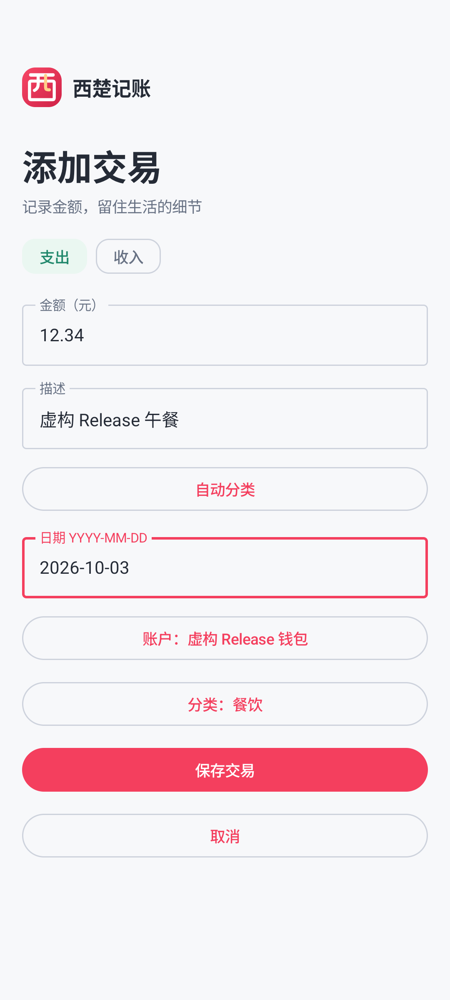

# 西楚记账 v1.0.4 — 修复空账户不能保存收支

2026-10-07 (Asia/Shanghai), in the existing `xichugeek/XichuFinance` repository. Package `com.xichugeek.finance`, version **1.0.4**, code **5**, same Release signer.

## Report and cause

The owner confirmed that cloud login now takes a few seconds on China Telecom 5G, then reported that both expense and income could not be saved and the account chooser had no options. The login feedback is an owner observation, not an instrumented speed measurement.

New cloud ledgers intentionally have no bookkeeping accounts. The previous transaction editor still displayed an empty dropdown and enabled Save; its ViewModel then rejected the missing account. The screen did not offer a way to create an account while entering a transaction.

## Changes

- An empty account list now shows a clear explanation and an **添加账户** action on the transaction form. Save is disabled until a valid account and matching category exist.
- Create a named cash, bank, credit, Alipay, WeChat or other bookkeeping account in a dialog without leaving the form. The created account is selected automatically; amount, description, date and income/expense type are retained. Canceling the dialog also retains the draft.
- Existing accounts can be selected normally; the dropdown also offers **＋ 添加账户**. Valid account/category selections survive additions to their lists, instead of resetting to the first item when the list size changes.
- Account creation returns the actual persisted ID, validates the name/type locally and checks the cloud response's ownership before caching/selecting it. The account is not selected if creation fails; the dialog shows the error.
- Existing categories, Chinese branding, the bottom Settings entry, login deadlines and concurrent sync remain available.

This is an Android update using the existing account API. No Backend deployment, production configuration, DNS, secrets or database schema change is needed. Acceptance uses fictional users/data through the previously approved HTTPS service.

## Actual verification

| Check | Actual result |
| --- | --- |
| Clean signed build | PASS — 2m 5s; 107 tasks; **18 Release JVM tests** |
| Signed production workflow | PASS — `OK (1 test)`; **38.651s for the entire workflow**, not login alone; direct HTTPS, no emulator proxy, normal TLS validation |
| Empty-account path | Save disabled; canceling account creation keeps the draft; inline creation auto-selects the new cash account; expense 12.34 saved with the entered date |
| Income / multiple accounts | Bank account created and auto-selected in the income form; picker switches between existing accounts; adding a third account preserves the chosen bank account; income 1234.56 persisted with correct type, category, account and date, confirmed through the real API |
| Existing workflow | Category creation/rename/delete protection; transaction edit/delete; CSV preview/import/duplicate prevention; analytics/Ask; restart and logout/login retention all passed |
| Update / cold launch | Compatible cover installation succeeded; cold launch 714ms; fictional 19.00 expense resynchronized and retained |
| Signing / identity | `西楚记账`, `com.xichugeek.finance`, code 5/version 1.0.4; valid APK signature, same signer as earlier releases; AAB signature verified |
| Lint / artifact review | 0 errors / 14 existing warnings; production HTTPS present; Debug HTTP, checked secrets and private files absent; debugging/cleartext/Android backup disabled |

The initial UI test encountered an ambiguous selector between the form's and dialog's “取消” buttons. The test was corrected to target the dialog and its signed test APK was rebuilt (28s). The application APK was unchanged; the final workflow above passed. Physical phone acceptance of this account-entry fix still follows installation.

| Artifact | Bytes | SHA256 |
| --- | ---: | --- |
| `XichuFinance-v1.0.4.apk` | 8,831,162 | `e68da0f7e35091e0c32af90aa2e8e045c88245b444b08570b79713ba04b869bb` |
| `XichuFinance-v1.0.4.aab` (optional) | 8,451,540 | `721c1f0ea1059f4b0008607a9c7839b0e8007f6d570c37d76dbfae7270e8634d` |

Public signing certificate SHA256: `8f69ab65fbbebf6fd1b715a842d2af82e69113c43fbd037161ba1e1280ccf160`.

## Install

Install `dist/XichuFinance-v1.0.4.apk` over the previous signed version; **do not uninstall**. The same package/signature permits a compatible update. In the transaction form, tap “添加账户”, enter a name such as “现金” or “工资卡”, choose its type and tap “添加并选择”, then save the income/expense.

See [installation guide](ANDROID_RELEASE.md), [beginner guide](BEGINNER_GUIDE.md), [v1.0.3 history](RELEASE_NOTES_v1.0.3.md) and [existing limits](RELEASE_NOTES_v1.0.0.md#v1-limits).
