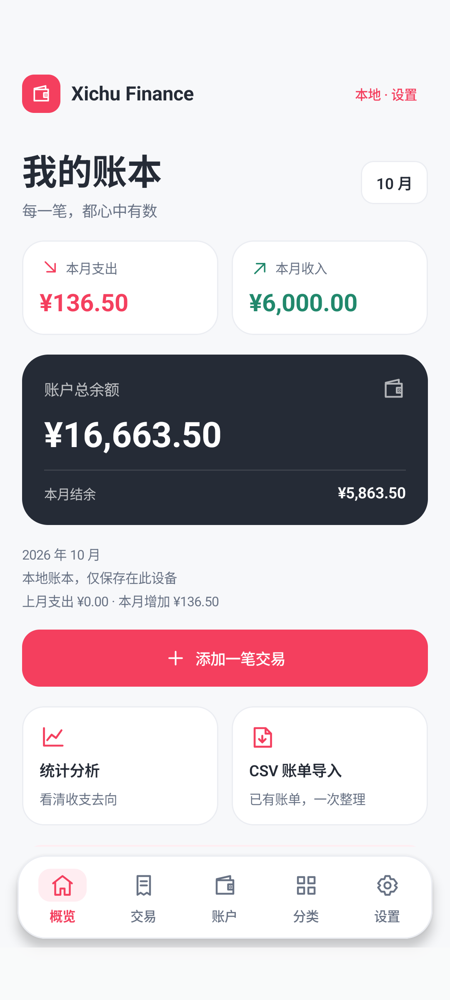
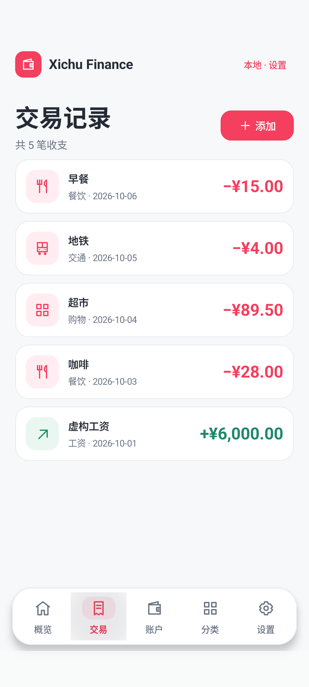
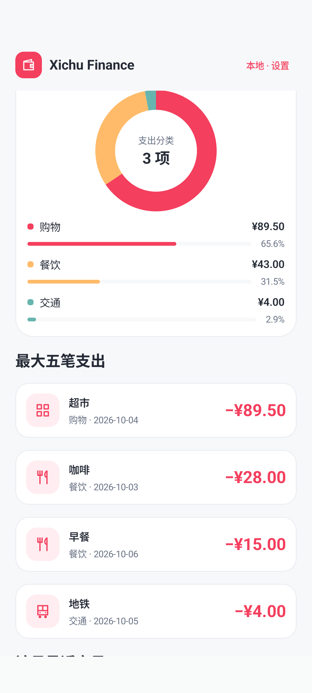
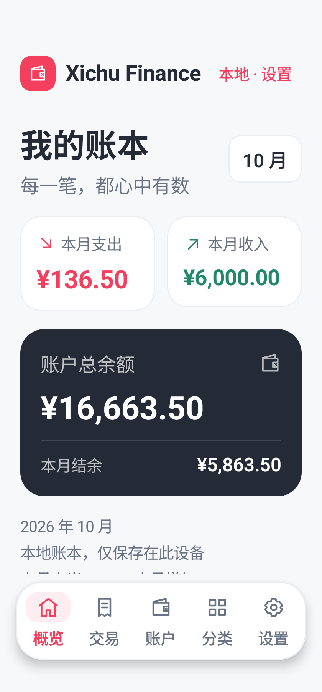
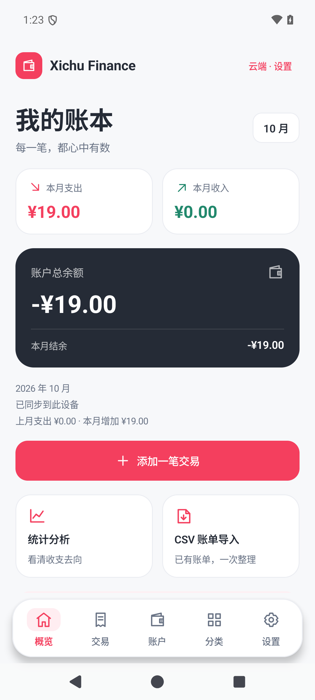

# Android UI refresh — v1.0.1

Checked on 2026-10-06, in the original XichuFinance checkout. [Release notes](RELEASE_NOTES_v1.0.1.md). Historical v1.0.0 evidence remains in [its original acceptance record](APK_RELEASE_VALIDATION.md).

## Layout and styling

The previous bottom navigation rendered a Chinese initial as its icon and then a second, full text label. It now uses original vector icons, one label per destination, a selected state, separate touch targets and system navigation insets. Scaffold content consumes its padding; form screens respect keyboard insets. The theme explicitly defines white surface/container colors instead of inheriting purple Material defaults.

The dashboard, transaction rows, account cards and analytics have consistent typography, spacing, colors and rounded cards. Expense/action accents are red; income is green. Daily trend fill, category ring and percentage bars use actual ledger totals. No reference app's financial data, artwork or brand assets were copied.

## Actual verification

| Check | Recorded result |
| --- | --- |
| Final clean signed build | PASS — 2m 7s, 107 tasks; 11 Release JVM tests |
| Release Lint | PASS — 0 errors, 4 warnings |
| APK identity/signing | PASS — package `com.xichugeek.finance`, version `1.0.1`, code `2`, min API `26`, target API `35`; APK v2 signature verified |
| Same signer update | PASS — `adb install -r` over signed v1.0.0 succeeded; cloud login and two fictional cached records were retained, with total expense 19.00 CNY |
| Final APK reinstall/cold launch | PASS — install succeeded, cold launch 555ms; retained cloud login and expense 19.00 CNY, then displayed successful production synchronization |
| Normal layout, three-button navigation | PASS — real Activity, 411dp / font 1.0; layout and local CRUD tests passed in 9.587s |
| Small layout, gesture navigation | PASS — real Activity, 320dp / font 1.3; one layout test passed in 8.516s |
| Layout assertions | All five labels have one line without overflow; touch targets at least 48dp; adjacent tabs do not overlap; scrolled main action stays above navigation; account save remains reachable with keyboard open; all destinations and charts/month switching work |
| Local transaction workflow | PASS — actual UI save/edit/delete with keyboard insets; exact 12.34 → 10.50 CNY values and restoration of the original record count |
| Full signed production workflow | PASS — 44.791s, `OK (1 test)`; UI registration/login, account creation, transaction CRUD, CSV preview/import/duplicate skipping, statistics, exact Ask answer, restart and logout/login retention |
| APK review | PASS — no private signing files or checked known signing/database secret values; production HTTPS included, emulator HTTP excluded; backup/cleartext/debugging disabled |

Layout tests use the real MainActivity and a separate local fictional ledger. Production workflow tests use owned fictional users and records. The old flow test was adjusted to scroll to form actions after keyboard insets reduced the viewport. This does not bypass the real buttons or save operations.

Direct emulator requests encountered connection timeouts. The computer's already configured local HTTP proxy was temporarily applied to the task's emulator for the passing production run. The app still used the real public HTTPS domain with normal certificate/hostname checks. No proxy was embedded in the APK and no production networking configuration was changed. The emulator proxy/display/navigation settings were restored after acceptance. This does not establish reliable connectivity on every network.

APK/AAB/checksums, release notes, installation guide and license have a separate byte-verified v1.0.1 backup. The original signing backup and v1.0.0 APK were checked and remain intact.

Public signing certificate SHA256 remains:

```text
8f69ab65fbbebf6fd1b715a842d2af82e69113c43fbd037161ba1e1280ccf160
```

## Delivered artifacts

| File | Bytes | SHA256 |
| --- | ---: | --- |
| `dist/XichuFinance-v1.0.1.apk` | 8,795,746 | `7bd2df3c02b0403b7a2ed6d046e9b29773db0cf6af1abc6206c8cd6c2221f69d` |
| `dist/XichuFinance-v1.0.1.aab` (optional) | 8,421,056 | `5390db697659a559efd18cd162ee3d0b67fcf28bd94941b9f048c76b06a85772` |

Artifacts/sidecars are ignored by Git. The original v1.0.0 files are retained. Install the APK over the owner's signed v1.0.0; see [installation/build guide](ANDROID_RELEASE.md). Do not uninstall the existing app for this update.

## Actual emulator screenshots

All displayed records are fictional local fixtures. These images are actual app renders, not design mockups.










The final APK after reinstall and cold launch, with fictional cloud acceptance data and Android three-button navigation:



Android 15 emulator layouts were verified at the configurations above. Physical/OEM devices and every accessibility font/display setting are not yet verified. Existing [v1 functional/security limits](RELEASE_NOTES_v1.0.0.md#v1-limits) remain applicable. The Backend and production configuration were not changed by this UI update.
